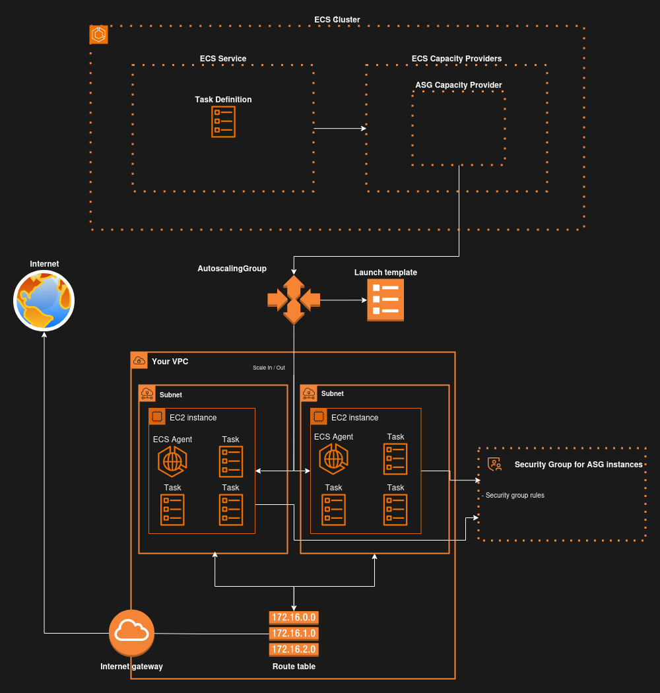

# mandoca
Implementation of an AWS ECS cluster using the Autoscaling group capacity provider

## The problem

The setup of an aws environment for orchestrating service containers on top of EC2 instances require the creation, connection and configuration of many resources. Even if you made it for one environment, you will likely need to repeat the process when recreating or replicating other environments.

## The solution

A terraform module that covers the declaration and configuration of all required aws resources to implement an ECS cluster that implements an Autoscaling group capacity provider to provision EC2 instances as the Infrastucture to run ECS tasks. You only provide parameters specific to your implementation like ports, desired_count, cidr blocks, etc and the module will build the environment. The ECS cluster will control the provision of EC2 instances according the needs of Infrastructure.

It implements practices of security, high availability and redundancy so you focus on templating and providing the container definitions.

## Architecture diagram



## 🚀 Setup instructions

Clone this repository and proceed with steps below.

### Parameters

Create a `terraform.tfvars` file with the following content, updating the values to suit your environment:

```hcl
asg_max_size = 1
asg_min_size = 1
app_name = "awesome-app"
env_prefix = "dev"
ami_id = "some-ami-id"
cluster_name = "awesome-cluster"
container_definitions_file_path = "/path/to/container-definitions/file.json"
desired_count = 1
instance_type = "t2.micro"
service_name = "awesome-service"
subnets_specs = {
    "subnet-1" = {
        avail_zone = "us-east-1a"
        cidr_block = "10.2.1.0/24"
    }
    "subnet-2" = {
        avail_zone = "us-east-1b"
        cidr_block = "10.2.2.0/24"
    }
}
task_definition_name = "awesome-task-definition"
vpc_cidr_block = "10.2.0.0/16"
```

Install providers and modules:

```hcl
terraform init
```

Call the module(See examples folder for a basic invoing example). You need to provide input parameters like the target vpc_id, the target ami_id, the target instance_type, etc. Provision those from the prepared `terraform.tfvars` file.

```hcl
module "ecs_cluster_with_asg_capacity_provider" {
  source                          = "../.."
  asg_max_size                    = var.asg_max_size
  asg_min_size                    = var.asg_min_size
  ami_id                          = var.ami_id
  cluster_name                    = var.cluster_name
  container_definitions_file_path = var.container_definitions_file_path
  desired_count                   = var.desired_count
  env_prefix                      = var.env_prefix
  instance_type                   = var.instance_type
  service_name                    = var.service_name
  subnets_specs                   = var.subnets_specs
  task_definition_name            = var.task_definition_name
  vpc_id                          = aws_vpc.module_vpc.id
}
```

Then plan and apply:

```hcl
terraform plan

terraform apply
```